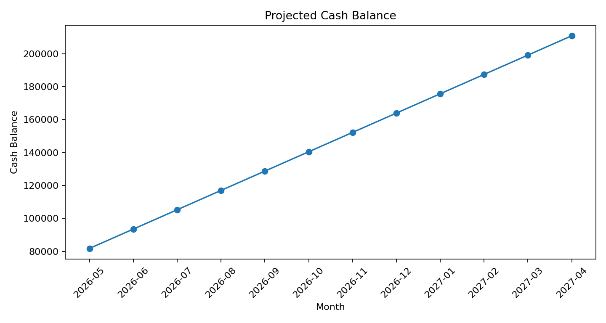

# 多 Agent 个人财务顾问报告

生成时间：2026-05-03 06:15:25

> 免责声明：本报告仅用于教育和信息参考，不构成投资、税务、保险或法律建议。

## 1. 用户画像

- 姓名：Demo User
- 年龄：28
- 风险偏好：medium
- 现金资产：¥40,000.00
- 应急金：¥30,000.00
- 投资资产：¥50,000.00

## 2. 总览

已处理 40 条交易。月均收入 ¥26,250.00，月均支出 ¥14,512.50，月均净现金流 ¥11,737.50，平均储蓄率 44.7%。

### 月度汇总

| 月份 | 收入 | 支出 | 净现金流 | 储蓄率 |
|---|---:|---:|---:|---:|
| 2026-01 | ¥25,000.00 | ¥12,900.00 | ¥12,100.00 | 48.4% |
| 2026-02 | ¥25,000.00 | ¥15,470.00 | ¥9,530.00 | 38.1% |
| 2026-03 | ¥30,000.00 | ¥13,620.00 | ¥16,380.00 | 54.6% |
| 2026-04 | ¥25,000.00 | ¥16,060.00 | ¥8,940.00 | 35.8% |

### 支出类别 Top

| 类别 | 支出 | 笔数 |
|---|---:|---:|
| Housing | ¥24,000.00 | 4 |
| Food | ¥11,800.00 | 8 |
| Shopping | ¥7,600.00 | 4 |
| Debt Payment | ¥6,000.00 | 4 |
| Utilities | ¥1,980.00 | 4 |
| Transport | ¥1,920.00 | 4 |
| Education | ¥1,700.00 | 2 |
| Health | ¥1,150.00 | 2 |

## 3. Agent 分析结果

### DataIngestionAgent

已处理 40 条交易。月均收入 ¥26,250.00，月均支出 ¥14,512.50，月均净现金流 ¥11,737.50，平均储蓄率 44.7%。

**建议：**
- 当前最大支出类别是 Housing，累计支出 ¥24,000.00。

### BudgetAgent

按 50/30/20 框架：建议必要支出≤¥13,125.00，弹性消费≤¥7,875.00，储蓄/投资≥¥5,250.00。

### ForecastAgent

基于历史均值预测，未来 12 个月月均净现金流约为 ¥11,737.50。

**建议：**
- 应急金已超过 3 个月支出，可继续逐步补足到 6 个月。
- 若维持当前结余，每年可新增储蓄约 ¥140,850.00。

### DebtAgent

识别到 2 笔债务，总余额 ¥47,000.00。

**风险提醒：**
- 存在高息债务：Credit Card。

**建议：**
- 优先采用雪崩法：在满足所有最低还款后，把额外现金流集中偿还最高 APR 债务。
- 债务总额 ¥47,000.00，每月最低还款合计 ¥1,400.00。
- 雪崩法顺序：Credit Card(18.0%) → Student Loan(4.5%)
- 雪球法顺序：Credit Card(¥12,000.00) → Student Loan(¥35,000.00)

### RiskAgent

综合财务风险评分 70/100，风险水平：中等。

**风险提醒：**
- 应急金不足 3 个月支出。

**建议：**
- 建议至少补足到 3 个月支出：目标约 ¥43,537.50。

### InvestmentAgent

根据年龄、风险偏好和现金储备，估计适合的投资风险档位为：medium。

**风险提醒：**
- 应急金不足时，不建议贸然增加高波动资产。

**建议：**
- 优先补充应急金，再考虑长期投资。

## 4. 现金流预测图

## 5. 建议执行顺序

1. 先确保月度现金流为正，并建立最低 3 个月支出的应急金。
2. 对高息债务采用雪崩法优先偿还。
3. 对最大支出类别设置预算上限，连续跟踪 3 个月。
4. 应急金达标后，再按风险档位做长期资产配置。
5. 每月更新流水，每季度复盘预算、债务和资产配置。
